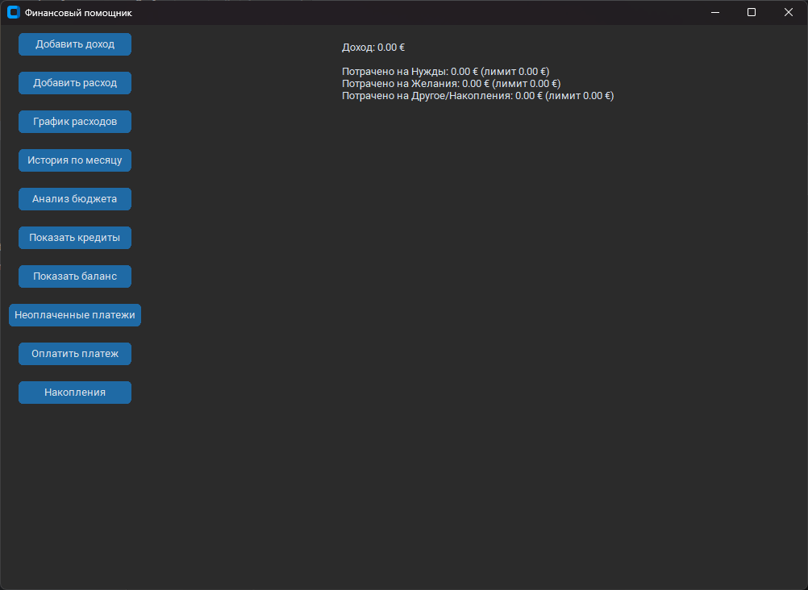

# Finance Manager

Приложение для контроля личных финансов в современном UI-стиле Discord.


---

## 📸 Скриншот



---

## 🚀 Возможности:

- 📥 Добавление доходов и расходов
- 📊 Графики расходов по категориям
- 📈 Анализ бюджета по системе 50/30/20
- 💳 Управление ежемесячными платежами и кредитами
- 🏦 Прогресс накоплений к финансовой цели

---

## ⚡ Установка и запуск:

### 1. Клонировать репозиторий:

```bash
git clone https://github.com/Frzok/finance_manager.git
cd finance_manager
```

### 2. Создать виртуальное окружение:

```bash
python -m venv .venv
```
### 3. Активировать виртуальное окружение:

```bash
.venv\\Scripts\\activate
```

### 4. Установить зависимости:

```bash
pip install -r requirements.txt
```
### 5. Запустить приложение:

```bash
python "Finance UI App.py"
```
